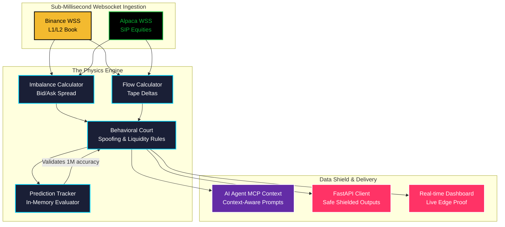

<div align="center">
  <h1>HORUS 👁️ | Sub-Second Institutional Orderflow Intelligence</h1>

  <p><strong>A True Market Gravity Engine for Autonomous AI Agents and HFT Traders.</strong></p>

  <p>
    
    
    
    
  </p>
</div>

---

## 🛑 Stop Predicting Candles. Start Measuring Gravity.
Retail traders use trailing indicators (RSI/MACD) to guess what the market will do based on the *past*. **Horus** uses Level 2 Orderbook physics, Tick imbalances, and 5-Second Flow Deltas to measure exactly what institutional whales are doing *right now*. 

Horus doesn't ask "Are we overbought?". It measures gravitational pull and tells you: *"Whales are spoofing the bid and aggressive takers are tearing through the ask. Liquidity is collapsing. Bailout now."*

---

## ⚡ Why AI Agents (Claude, Cursor) Love Horus

If you hook up an AI Agent to a basic technical indicator feed, it gets confused by noise. 
If you feed an AI Agent **Horus**, it gets an institutional grade decision matrix. 

Look at what Horus catches in real-time during a **Liquidity Withdrawal / Flash Crash** attempt:

```json
{
  "symbol": "BTCUSDT",
  "signal": "LIQUIDITY_EVENT",
  "confidence": 0.99,
  "market_state": "DISTRIBUTION",
  "risk": "EXTREME",
  "description": "Liquidity withdrawn under price. Aggressive taking.",
  "metrics": {
    "bid_ask_ratio": 7.934,
    "buy_sell_ratio": 0.393,
    "delta_5s": -83040.05,
    "whale_activity": true,
    "large_sell_count": 4,
    "delta_accel": 3.8,
    "wall_side": "BID",
    "wiseman_climate": {
      "market_mode": "CHOP",
      "health": "FRAGILE",
      "confidence": 0.85
    },
    "flags": [
      "GLOBAL_LIQUIDITY_EVENT",
      "SPOOFING_DETECTED(wall=BID)"
    ]
  },
  "timestamp": 1776107738.975
}
```

### The Institutional Alpha:
1. **`bid_ask_ratio: 7.934` & `wall_side: BID`**: Massive spoofed bid walls are placed by whales below the market to create fake support.
2. **`buy_sell_ratio: 0.393`**: Horus sees through the spoofing (`SPOOFING_DETECTED` flag). It measures real *taker* flow and discovers aggressive selling is devastating the orderbook.
3. **`delta_accel: 3.8` & `whale_activity: true`**: Selling momentum accelerated by 3.8x natively tracking 4 major whale dumps within milliseconds.
4. **`wiseman_climate: FRAGILE`**: Integrates perfectly with the overarching Horus SaaS macro brain, verifying that Bitcoin's holistic environment is fragile before attacking.
5. **The Verdict**: With a `0.99` Confidence factor, the AI engine triggers `LIQUIDITY_EVENT`. It front-runs the ensuing 1-minute crash. **This is Institutional Grade.**

---

## 🏗️ Architecture



---

## 🚀 Quickstart for Trading Bots

Getting started with Horus takes less than 60 seconds. 
**⚡ Test Instantly:** Download our [Postman Collection](./horus_postman_collection.json) to ping the API directly from your browser.

```bash
# 1. Install Dependencies
pip install -r requirements.txt

# 2. Fire up the Core Engine
uvicorn app.main:app --host 0.0.0.0 --port 8011
```

In your local Bot / Agent, simply pull the live flow for any Crypto or US Equity:

```python
import requests

response = requests.get(
    "http://127.0.0.1:8011/v1/flow/crypto/BTCUSDT", 
    headers={"X-API-Key": "your_secure_api_key"}
)

flow_data = response.json()

# The Zero-Human Decision Loop:
if flow_data['signal'] in ['EMERGENCY_DUMP', 'BAILOUT', 'LIQUIDITY_EVENT']:
    print("Market gravity collapsing. Market selling all positions.")
    # execute_market_sell()
```

---

## 🌐 Live Real-Time Dashboard
Horus comes with a stunning glass-morphism WebSocket dashboard out-of-the-box (`/dash/`). 
It features a **Local Edge Proof Tracker** that strictly measures 1-Minute Candle directional predictions generated by the Physics Engine with an openly transparent win rate.

---
*Built with absolute precision for those who need to see the Matrix.*
<br/>**— HORUS INTELLIGENCE**  👁️
