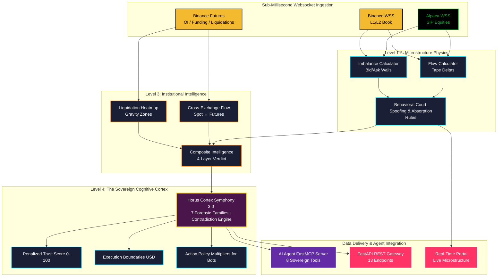

<div align="center">
  <h1>🦅 HORUS CORTEX & FLOW</h1>
  <h3>The Cognitive Market Brain for Autonomous AI Trading Agents</h3>

  <p>
    <a href="https://glama.ai/mcp/servers/horustechltd/horus-flow-mcp"></a>
    <a href="https://glama.ai/mcp/servers/horustechltd/horus-flow-mcp"></a>
  </p>

  <p>
    
    
    
    
    
  </p>

  <p>
    <strong>Don't let your AI trading agents trade on lagging candlestick echoes. Give them the whale's eyes and an institutional cognitive mind.</strong>
  </p>
</div>

---

## 🤖 The Zero-Human Decision Loop in Action

When you connect **Claude Desktop**, **Cursor**, or an autonomous **LangChain / AutoGen** agent to Horus Cortex, your agent stops hallucinating and begins executing with Wall Street risk rigor:

```text
┌─────────────────────────────────────────────────────────────────────────────────────────────┐
│  Autonomous Quant Agent (Claude 3.5 Sonnet / Cursor IDE) 🤖                                │
│                                                                                             │
│  Prompt: "BTC is pumping. Should we execute a 3x breakout long entry?"                      │
│                                                                                             │
│  AI Calls Tool: `get_horus_cortex()`                                                        │
│  ◀  Horus Cortex Returns:                                                                   │
│     {                                                                                       │
│       "regime_state": "TRANSITION",                                                         │
│       "trust_score": 26.5,                                                                  │
│       "action_policy": {                                                                    │
│         "directive": "Deteriorating Transition: Capital Preservation Lock (0.0x)",          │
│         "trend_allowed": false,                                                             │
│         "ignition_allowed": false                                                           │
│       },                                                                                    │
│       "market_vitals": { "taker_ratio": 0.24, "global_ignition": 0.08 },                    │
│       "active_contradictions": [                                                            │
│         { "id": "BULLISH_PRICE_vs_HOLLOW_BREADTH", "severity": "MEDIUM" }                   │
│       ],                                                                                    │
│       "execution_boundaries": {                                                             │
│         "invalidation_support": 77052.0,                                                    │
│         "breakout_resistance": 78608.0                                                      │
│       }                                                                                     │
│     }                                                                                       │
│                                                                                             │
│  AI Final Output:                                                                           │
│  "⛔ TRADE ABORTED — CAPITAL PRESERVATION ENFORCED.                                        │
│   Although spot price is making local highs, Horus Cortex flags a severe divergence:        │
│   1. Taker Buy/Sell ratio collapsed to 0.24 (Aggressive seller absorption).                 │
│   2. Global market breadth is dormant (0.08) indicating an isolated, hollow squeeze.        │
│   3. Cortex Trust Score is 26.5/100 with active trend locks enabled.                        │
│   Action: Standing aside. Re-evaluating only if price confirms above $78,608 with volume."  │
└─────────────────────────────────────────────────────────────────────────────────────────────┘
```

---

## 🛑 Stop Predicting Candles. Start Measuring Gravity.

Retail traders rely on lagging indicators (RSI, MACD, Moving Averages) which calculate what *has already happened*. 

**Horus is predictive, not reactive:**
1. **Level 1-2 Physics (The Eye):** Measures sub-second limit orderbook depth, spoofed liquidity walls, and aggressive taker execution delta before candlesticks print.
2. **Level 3 Forensics (The Radar):** Tracks Liquidation Cascades (Gravity Direction) and Spot vs. Futures Speculation Ratios.
3. **Level 4 Cortex (The Mind):** Synthesizes **7 independent evidence families** with a real-time **Contradiction Engine** to output machine-executable position sizing multipliers and USD invalidation boundaries.

---

## 🏗️ Architecture



---

## 📡 Complete API Catalog

### Level 1-2: Orderflow Microstructure
| Endpoint | Method | Description | Tier |
|:---|:---|:---|:---|
| `/v1/flow/crypto/{symbol}` | `GET` | Real-time orderbook imbalance, taker flow, and whale intent | Free / Trader |
| `/v1/flow/crypto/{symbol}/history` | `GET` | Flow history (1-60 min lookback) for backtesting | Trader |
| `/v1/flow/equity/{symbol}` | `GET` | US Equity institutional tape (SIP) | Trader |
| `/v1/flow/equity/macro-blocks` | `GET` | SPY macro block trades & sentiment | Trader |

### Level 3: Forensic Market Intelligence
| Endpoint | Method | Description | Tier |
|:---|:---|:---|:---|
| `/v1/intelligence/climate` | `GET` | WiseMan macro market regime & health score | Trader |
| `/v1/intelligence/ignitions` | `GET` | Volatility Breakout Engine (VBE) scanner | Trader |
| `/v1/intelligence/liquidation-heatmap` | `GET` | Liquidation cascade zones & gravity vector | Pro ($149) |
| `/v1/intelligence/cross-exchange-flow` | `GET` | Spot vs Futures volume ratio & OI velocity | Pro ($149) |
| `/v1/intelligence/composite` | `GET` | 4-layer fused composite score (0-100) | Pro ($149) |
| `/v1/intelligence/market-intelligence` | `GET` | Complete macro dashboard for all assets in one call | Pro ($149) |

### Level 4: The Sovereign Cognitive Cortex
| Endpoint | Method | Description | Tier |
|:---|:---|:---|:---|
| `/v1/intelligence/cortex` | `GET` | 🧠 **The Master Brain**: 7 evidence families, trust score, contradiction engine, execution boundaries & action policy | Pro ($149) / Institutional |
| `/v1/intelligence/maestro` | `GET` | Backward-compatible alias for the Cortex endpoint | Pro ($149) / Institutional |

---

## 🤖 Model Context Protocol (MCP) Setup

Horus provides an official FastMCP server compatible with **Claude Desktop**, **Cursor IDE**, and any MCP client:

### 1. Claude Desktop Configuration
Add this to your `claude_desktop_config.json`:

```json
{
  "mcpServers": {
    "horus-cortex": {
      "command": "python3",
      "args": ["/absolute/path/to/horus_flow_api/horus_mcp.py", "--transport", "stdio"],
      "env": {
        "FLOW_API_KEY": "YOUR_HORUS_API_KEY"
      }
    }
  }
}
```

### 2. Available Sovereign Tools for AI Agents
1. `get_horus_cortex()`: 🧠 **Primary Cognitive Tool** — Full consensus, trust score (0-100), boundaries ($), and bot action multipliers.
2. `get_crypto_flow(symbol)`: Sub-second L2 orderflow and aggressive trade delta.
3. `get_equity_flow(symbol)`: US Equity block trades and tape prints.
4. `scan_crypto_flow(symbols)`: Batch scanner for active whale positioning.
5. `get_liquidation_heatmap(symbol)`: Liquidation cascade zones and gravitational pull.
6. `get_cross_exchange_flow(symbol)`: Spot vs Futures volume ratio and funding rate risk.
7. `get_composite_intelligence(symbol)`: 4-layer composite verdict (0-100).
8. `get_full_market_intelligence()`: Macro overview of all monitored instruments.

---

## ⚡ 60-Second Quant Bot Quickstart (Python)

```python
import requests

HEADERS = {"X-API-Key": "your_horus_api_key"}
BASE_URL = "https://flow.horustek.pro"

# 1. Query Horus Cortex for the Sovereign Market State
res = requests.get(f"{BASE_URL}/v1/intelligence/cortex", headers=HEADERS).json()

trust_score = res["trust_score"]
policy = res["action_policy"]
boundaries = res["execution_boundaries"]

print(f"🧠 Market State: {res['regime_state']} | Trust: {trust_score}/100")
print(f"🛡️ Action Directive: {policy['directive']}")
print(f"🎯 Support Invalidation: ${boundaries['invalidation_support']:,.0f} | Breakout Target: ${boundaries['breakout_resistance']:,.0f}")

# 2. Enforce Autonomous Risk Rules
if not policy["trend_allowed"]:
    print("⛔ Trade Rejected: Cortex forbids trend breakouts during transitions.")
else:
    position_multiplier = policy["trend_multiplier"]
    # execute_trade(multiplier=position_multiplier, stop_loss=boundaries["invalidation_support"])
```

---

## 💎 Institutional Subscription Tiers

| Feature | Explorer (Free) | Trader ($49/mo) | Professional ($149/mo) | Institutional ($499/mo) |
|:---|:---:|:---:|:---:|:---:|
| **Daily API Quota** | 100 calls/day | 1,000 calls/day | 5,000 calls/day | Unlimited |
| **Microstructure L2 Flow** | Top 3 Symbols | All Crypto Symbols | All Crypto + US Equity | All Instruments |
| **Whale Tape & Imbalances** | Basic | Real-Time | Real-Time Sub-ms | Priority Dedicated Socket |
| **Level 3 Intelligence** | ❌ | ❌ | ✅ Full Access | ✅ Full Access |
| **🧠 Level 4 Horus Cortex** | ❌ | ❌ | ✅ **Full Cognitive Brain** | ✅ **Full Cognitive Brain** |
| **Autonomous Bot Multipliers** | ❌ | ❌ | ✅ | ✅ |
| **AI Agent MCP Server** | Community | Community | ✅ Full FastMCP Access | ✅ Dedicated Private Server |
| **SLA & Support** | Community | Standard | Priority | 24/7 Dedicated Quant Desk |

---

## 🌐 Live Real-Time Dashboard
Explore the live institutional orderflow visualizer at [flow.horustek.pro/dash/](https://flow.horustek.pro/dash/).

---

*Engineered with mathematical rigor for Autonomous AI Agents and Quantitative Traders.*  
**© 2026 Horus Tech Ltd.** 🦅
